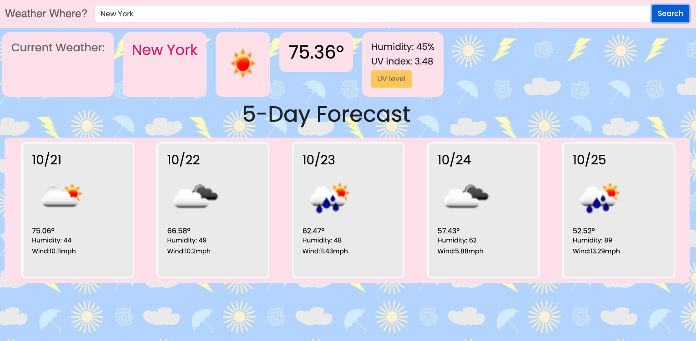

# Weather Dashboard

This is a simple weather dashboard.  It uses a weather API to tell conditions for the current day as well as for the next five days. In addition to the temperature and humidity it also gives a uv rating indicator that spans from yellow to red depending on the current uv levels (red being dangerous).  I made a custom svg background for the page using Adobe Illustrator.  It was coded with HTML, CSS, JavaScript and Bootstrap.

## Installation

https://artbat6.github.io/Weather-Dashboard/

To check the weather simple ender your city name and click submit.

### Author

Arthur Bates

